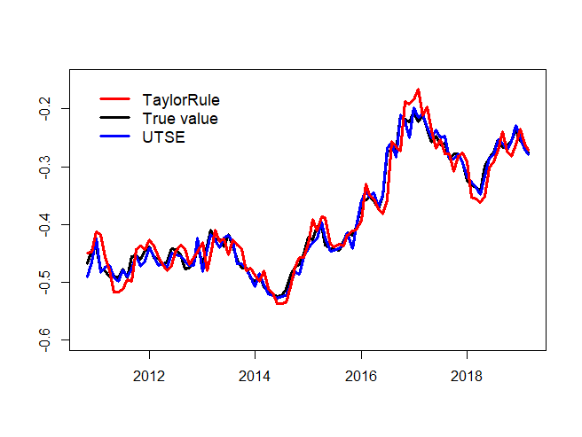
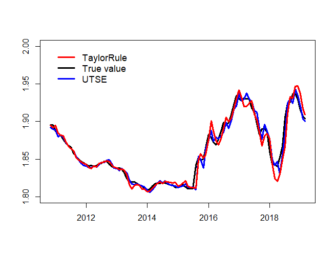
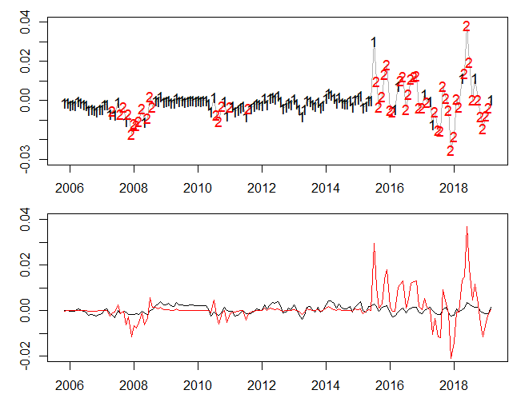
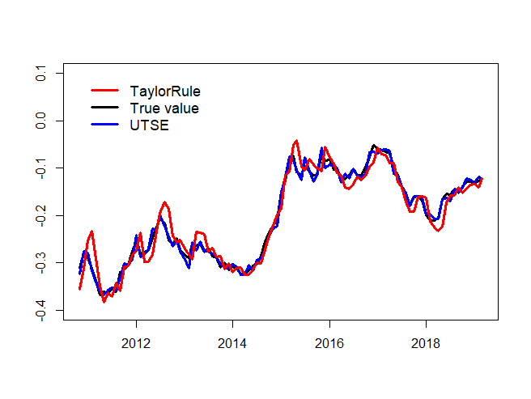
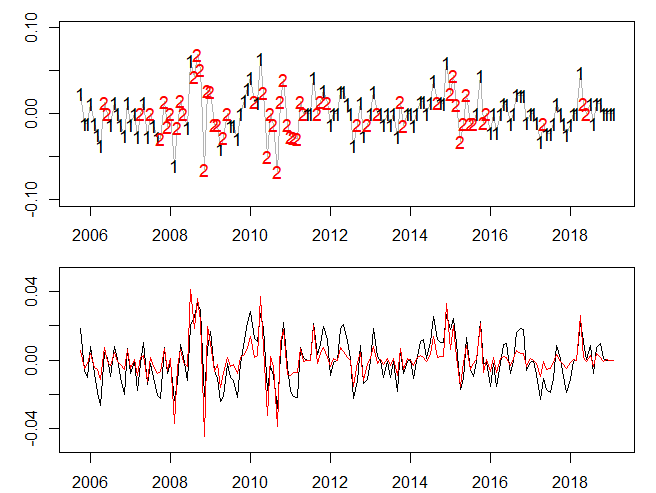
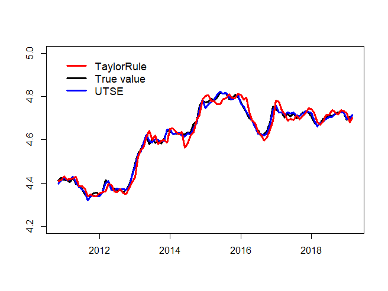

[](http://quantlet.de/)

## [](http://quantlet.de/) **UTSE** [](http://quantlet.de/)

```yaml

Name of Quantlet: UTSE

Published in: submitted to N/A 

Description: 'Performs the Unified term structure of exchange rates in solving the exchange rate forecasting puzzle in short 
forecasting horizon.'

Keywords: 'linear model, regression, state-space model, time varying, Markov Switching, exchange rates, prediction.'

Author: Xinjue Li

Submitted:  22 August 2019 by Xinjue Li

Datafile: Chian.csv, Japan.csv, British.csv, Euro.csv

Input: 
- a                 : Starting point of observations 
- b                 : Ending point of observations 
- alpha1            : The AR(1) process coefficient of the periodic component
- beta1             : The AR(1) process coefficient of the sharp rise and sharp fall component
- SQl               : Variance of the error term in the priodic component
- SQ2               : Variance of the error term in the sharp rise and sharp fall component 

```













### R Code
```r


setwd("C:/")
library(MASS)
rm(list = ls(all = TRUE))
graphics.off()
a = 1
b = 101
Data     = read.csv("British.csv")
True     = Data[a:b, 2]
FTSE     = Data[a:b, 3]
FNTaylor = Data[a:b, 4]
FLTaylor = Data[a:b, 5]
FPPP     = Data[a:b, 6]
Random   = Data[a:b, 7]
k        = 1:(length(True)) 
Time     = as.Date(Data[, 1][k])
plot(Time, True[k], type="n", ylab="", ylim=c(-0.6,-0.15), xlab="")
lines(Time, True[k], col='black', lwd = 3)
lines(Time, FTSE[k], col= 4 , lwd  =3)
lines(Time, FLTaylor[k], col=2, lwd = 3)
legend(Time[3],-0.15, c("TaylorRule","True value", "UTSE"),lty=c(1,1,1), lwd =c(3,3,3), pch=c('','',''), col=c(2,1,4), cex=1.1, bty='n')
#MAE
e1           = True-FTSE
e2           = True-Random
e3           = True-FNTaylor
e4           = True-FLTaylor
e5           = True-FPPP
RMSEFTSE     = sqrt(mean(e1^2))
RMSERandom   = sqrt(mean(e2^2))
RMSEFNTaylor = sqrt(mean(e3^2))
RMSEFLTaylor = sqrt(mean(e4^2))
RMSEFPPP     = sqrt(mean(e5^2))
MAEFTSE      = mean(abs(e1))
MAERandom    = mean(abs(e2))
MAEFNTaylor  = mean(abs(e3))
MAEFLTaylor  = mean(abs(e4))
MAEFPPP      = mean(abs(e5))
A            = c(RMSEFTSE, RMSERandom, RMSEFNTaylor, RMSEFLTaylor, RMSEFPPP)
B            = c(MAEFTSE, MAERandom, MAEFNTaylor, MAEFLTaylor, MAEFPPP)
A
B
write.csv(data.frame(A, B),file="ForecastingResultsEuro.csv", row.names=FALSE)
#DM-test
e1    = True-FTSE
e2    = True-Random
f.1   = abs(e1)-abs(e2)
V.hat = mean((f.1-mean(f.1))^2)
DMW   = mean(f.1)/sqrt(length(e1)^(-1)*V.hat)
DMW


# This is the final one for China
rm(list = ls(all = TRUE))
graphics.off()
YCdata      = read.csv("CUSTest2.csv")
#write.csv(flu, file="flu.csv")
y    = diff(log(as.matrix(YCdata[,2]))); num = length(y); nstate = 4;
M1   = as.matrix(cbind(1,0,0,1))  # obs matrix normal
M2   = as.matrix(cbind(1,0,1,1))  # obs matrix flu epi
prob = matrix(0,num,1); yp = y  # to store pi2(t|t-1) & y(t|t-1)
xfilter = array(0, dim=c(nstate,1,num)) # to store x(t|t)
# Function to Calculate Likelihood
Linn = function(para){
  alpha1 = para[1]; alpha2 = para[2]; beta1 = para[3]
  sQ1 = para[4];  sQ2 = para[5];  like=0
  xf  = matrix(0, nstate, 1)  # x filter
  xp  = matrix(0, nstate, 1)  # x pred
  Pf  = diag(.1, nstate)      # filter cov
  Pp  = diag(.1, nstate)      # pred cov
  pi11 <- .75 -> pi22;  pi12 <- .25 -> pi21; pif1 <- .5; .5 -> pif2
  phi = matrix(0,nstate,nstate)
  phi[1,1] = alpha1; phi[1,2] = alpha2; phi[2,1]=1; phi[3,3]=beta1; phi[4,4]=1
  Ups = as.matrix(rbind(0,0,0,0))
  Q   = matrix(0,nstate,nstate)
  Q[1,1] = sQ1^2; Q[3,3] = sQ2^2; R=0  # R=0 in final model
  # begin filtering #
  for(i in 1:num){
    xp   = phi%*%xf + Ups; Pp = phi%*%Pf%*%t(phi) + Q
    sig1 = as.numeric(M1%*%Pp%*%t(M1) + R)
    sig2 = as.numeric(M2%*%Pp%*%t(M2) + R)
    k1   = Pp%*%t(M1)/sig1; k2 = Pp%*%t(M2)/sig2
    e1   = y[i]-M1%*%xp; e2 = y[i]-M2%*%xp
    pip1 = pif1*pi11 + pif2*pi21; pip2 = pif1*pi12 + pif2*pi22
    den1 = (1/sqrt(sig1))*exp(-.5*e1^2/sig1)
    den2 = (1/sqrt(sig2))*exp(-.5*e2^2/sig2)
    denm = pip1*den1 + pip2*den2
    pif1 = pip1*den1/denm; pif2 = pip2*den2/denm
    pif1 = as.numeric(pif1); pif2 = as.numeric(pif2)
    e1   = as.numeric(e1); e2=as.numeric(e2)
    xf   = xp + pif1*k1*e1 + pif2*k2*e2
    eye  = diag(1, nstate)
    Pf   = pif1*(eye-k1%*%M1)%*%Pp + pif2*(eye-k2%*%M2)%*%Pp
    like = like - log(pip1*den1 + pip2*den2)
    prob[i] = pip2; xfilter[,,i] = xf; innov.sig = c(sig1,sig2)
    yp[i]   = ifelse(pip1 > pip2, M1%*%xp, M2%*%xp)  
  }
  return(like)   
}
# Estimation
alpha1   = .5; alpha2 = -0.2;  beta1= 0.3; sQ1 = .001; sQ2 = .01
init.par = c(alpha1, alpha2, beta1, sQ1, sQ2)
(est = optim(init.par, Linn, NULL, method='BFGS', hessian=TRUE, control=list(trace=1,REPORT=1)))
SE   = sqrt(diag(solve(est$hessian)))
u    = cbind(estimate=est$par, SE)
rownames(u)=c('alpha1','alpha2','beta1','sQ1','sQ2'); u
# Graphics
predepi = ifelse(prob<.5,0,1); k = 5:(length(y)-1) 
#YCtime = as.Date(YCdata[, 1])
Time    = as.Date(YCdata[, 1][k])
regime  = predepi[k]+1
par(mfrow=c(2,1), mar=c(2,3,1,1)+.1)     
plot(Time, y[k], type="n", ylab="", ylim=c(-.03,0.04))
grid(lty=2); lines(Time, y[k],  col=gray(.7))
text(Time, y[k], col=regime, labels=regime, cex=1.1)  
plot(Time, xfilter[1,,k], type="n", ylim=c(-.02,0.04), ylab="", col=1)
grid(lty=2); lines(Time, xfilter[1,,k]) 
lines(Time, xfilter[3,,k], col=2)
A = c(1:length(length(xfilter[3,,k])))
B = xfilter[3,,k]
write.csv(data.frame(A, B),"D:\\sharpriseorfalling.csv", row.names=FALSE)


#######
rm(list = ls(all = TRUE))
graphics.off()
#YCdata      = read.csv("CUSTest2.csv")
YCdata       = read.csv("EuroUSTest.csv")
#write.csv(flu, file="flu.csv")
y =diff(log(as.matrix(YCdata[,2]))); num = length(y); nstate = 3;
M1 = as.matrix(cbind(1,0,0))  # obs matrix normal
M2 = as.matrix(cbind(1,0,1))  # obs matrix flu epi
prob = matrix(0,num,1); yp = y  # to store pi2(t|t-1) & y(t|t-1)
xfilter = array(0, dim=c(nstate,1,num)) # to store x(t|t)
# Function to Calculate Likelihood
Linn = function(para){
  alpha1 = para[1]; alpha2 = para[2]; beta1 = para[3]
  sQ1 = para[4];  sQ2 = para[5];  like=0
  xf  = matrix(0, nstate, 1)  # x filter
  xp  = matrix(0, nstate, 1)  # x pred
  Pf  = diag(.1, nstate)      # filter cov
  Pp  = diag(.1, nstate)      # pred cov
  pi11 <- .75 -> pi22;  pi12 <- .25 -> pi21; pif1 <- .5; .5 -> pif2
  phi = matrix(0,nstate,nstate)
  phi[1,1] = alpha1; phi[1,2] = alpha2; phi[2,1]=1; phi[3,3]=beta1
  Ups = as.matrix(rbind(0,0,0))
  Q   = matrix(0,nstate,nstate)
  Q[1,1] = sQ1^2; Q[3,3] = sQ2^2; R=0  # R=0 in final model
  # begin filtering #
  for(i in 1:num){
    xp   = phi%*%xf + Ups; Pp = phi%*%Pf%*%t(phi) + Q
    sig1 = as.numeric(M1%*%Pp%*%t(M1) + R)
    sig2 = as.numeric(M2%*%Pp%*%t(M2) + R)
    k1   = Pp%*%t(M1)/sig1; k2 = Pp%*%t(M2)/sig2
    e1   = y[i]-M1%*%xp; e2 = y[i]-M2%*%xp
    pip1 = pif1*pi11 + pif2*pi21; pip2 = pif1*pi12 + pif2*pi22
    den1 = (1/sqrt(sig1))*exp(-.5*e1^2/sig1)
    den2 = (1/sqrt(sig2))*exp(-.5*e2^2/sig2)
    denm = pip1*den1 + pip2*den2
    pif1 = pip1*den1/denm; pif2 = pip2*den2/denm
    pif1 = as.numeric(pif1); pif2 = as.numeric(pif2)
    e1   = as.numeric(e1); e2=as.numeric(e2)
    xf   = xp + pif1*k1*e1 + pif2*k2*e2
    eye  = diag(1, nstate)
    Pf   = pif1*(eye-k1%*%M1)%*%Pp + pif2*(eye-k2%*%M2)%*%Pp
    like = like - log(pip1*den1 + pip2*den2)
    prob[i] = pip2; xfilter[,,i] = xf; innov.sig = c(sig1,sig2)
    yp[i] = ifelse(pip1 > pip2, M1%*%xp, M2%*%xp)  
  }
  return(like)   
}
# Estimation
alpha1 = .5; alpha2 = -0.15;  beta1= 0.3; sQ1 = .01; sQ2 = .01
init.par = c(alpha1, alpha2, beta1, sQ1, sQ2)
(est = optim(init.par, Linn, NULL, method='BFGS', hessian=TRUE, control=list(trace=1,REPORT=1)))
SE   = sqrt(diag(solve(est$hessian)))
u    = cbind(estimate=est$par, SE)
rownames(u) = c('alpha1','alpha2','beta1','sQ1','sQ2'); u
# Graphics
predepi = ifelse(prob<.5,0,1); k = 70:(length(y)) 
#YCtime = as.Date(YCdata[, 1])
Time    = as.Date(YCdata[, 1][k])
regime  = predepi[k]+1
par(mfrow=c(2,1), mar=c(2,3,1,1)+.1)     
plot(Time, y[k], type="n", ylab="", ylim=c(-.1,0.1)) #xaxt="n"
grid(lty=2); lines(Time, y[k],  col=gray(.7))
text(Time, y[k], col=regime, labels=regime, cex=1.1)
#axis.Date(1, at = seq(as.Date("2005/1/1"), max(Time)+6, "years"))
plot(Time, xfilter[1,,k], type="n", ylim=c(-.05,0.05), ylab="", col=1)
grid(lty=2); lines(Time, xfilter[1,,k]) 
lines(Time, xfilter[3,,k], col=2)

##############
library(MASS)
library(tseries)
rm(list = ls(all = TRUE))
graphics.off()
Reg = read.csv("sharpriseorfalling.csv")
Reg1 = apply(Reg[, c(-1)], c(1,2), as.numeric)
N    = length(Reg1[,1])
#Reg1 = diff(Reg1)
fit =lm(Reg1[2:(N), 1]~0+Reg1[2:(N), 2]+Reg1[2:(N), 3]+diff(Reg1[1:(N), 4]))
summary(fit)
adf.test(Reg1[1:(N-2), 1], k=1)
adf.test(Reg1[2:(N-1), 2], k=1)
adf.test(Reg1[2:(N-1), 3], k=1)
adf.test(diff(Reg1[1:(N-1), 4]), k=1)

rm(list = ls(all = TRUE))
graphics.off()
Reg  = read.csv("sharpriseorfallingEuroUSTure.csv")
Reg1 = apply(Reg[, c(-1)], c(1,2), as.numeric)
N    = length(Reg1[,1])
Reg1 = diff(Reg1)
fit  = lm(Reg1[2:(N-1), 1]~0+Reg1[2:(N-1), 2]+Reg1[2:(N-1), 3]+(Reg1[2:(N-1), 4]))
#fit.1 = lm(xfilter[3,,k]~xfilter[3,,k])
summary(fit)
adf.test(Reg1[1:(N-2), 1], k=1)
adf.test(Reg1[2:(N-1), 2], k=1)
adf.test(Reg1[2:(N-1), 3], k=1)
adf.test(Reg1[2:(N-1), 4], k=1)


```

automatically created on 2019-10-10